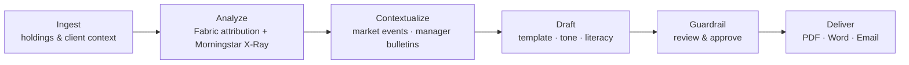
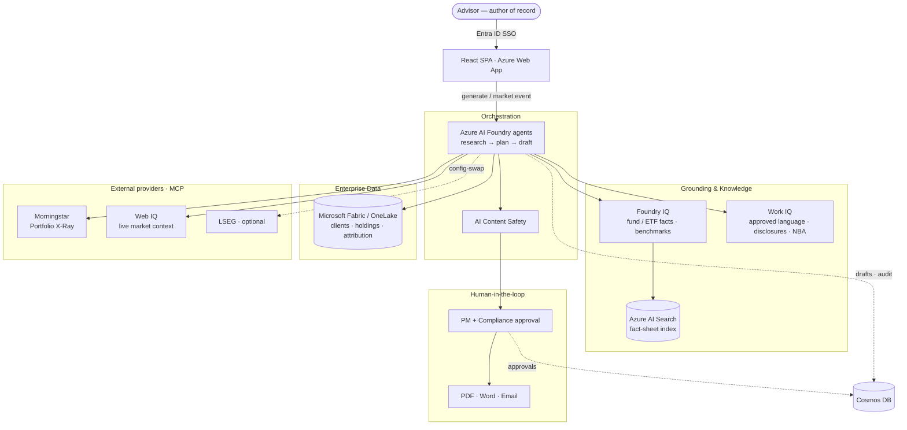
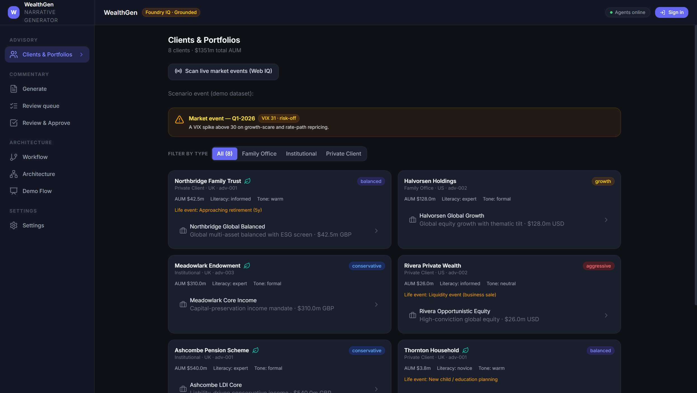
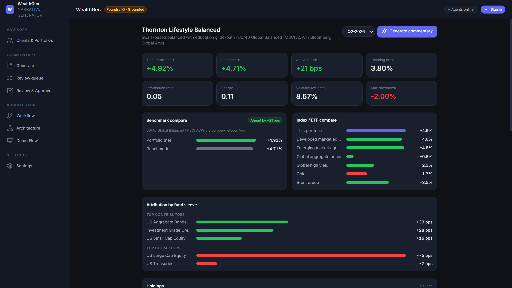
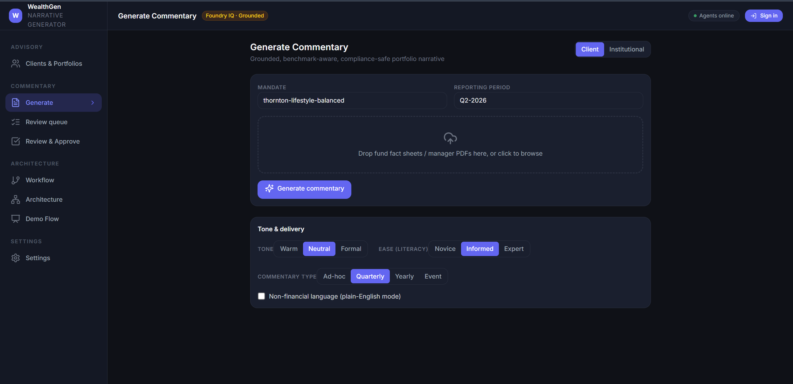
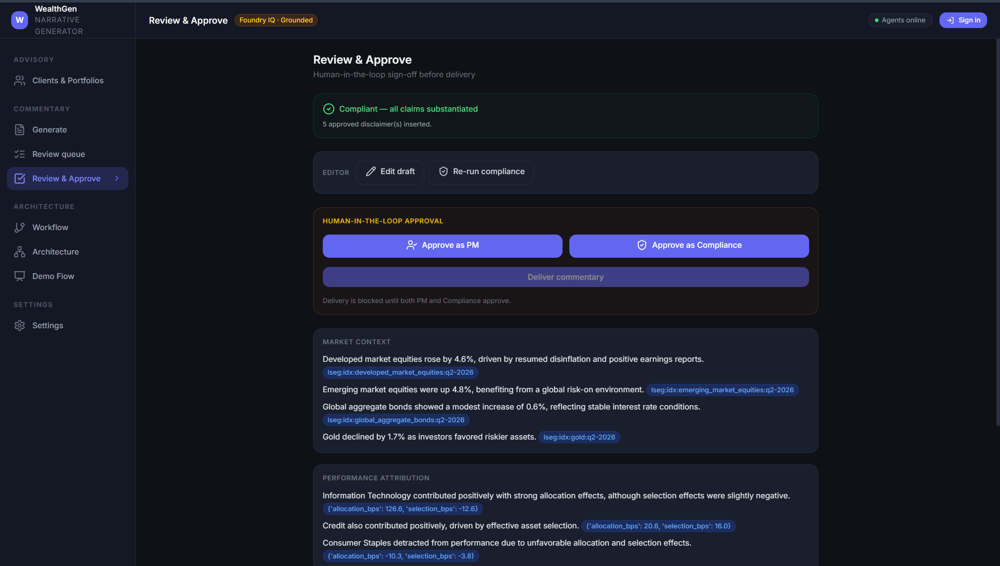

# WealthGen — Portfolio Narrative Generator

Bespoke, compliant, **grounded** portfolio commentary for financial advisors — in **seconds
instead of hours**. WealthGen assembles a client's holdings, independent analytics, live
market context, and the firm's approved language into a reviewed, ready-to-deliver narrative,
with a human approval gate before anything reaches a client.

> The advisor stays the author. WealthGen gives them their hours back.

---

## Quickstart

```powershell
# 1. Backend (FastAPI · http://localhost:8000)  — needs backend/.env (see Configuration)
./run_backend.bat

# 2. Frontend (Vite · http://localhost:5173, proxies /api → :8000)
./run_frontend.bat
```

Open **http://localhost:5173**, sign in with Entra ID, and start at **Clients & Portfolios**.
New here? Jump to [Prerequisites](#prerequisites) and [Configuration](#configuration). Deploying
to Azure? See [Deploy](#deploy-to-azure). Giving the demo? See [`DEMO_WALKTHROUGH.md`](DEMO_WALKTHROUGH.md).

---

## The problem

A bespoke, compliant portfolio narrative takes an advisor roughly **two hours** today — pull
the analytics, interpret them for *this* client's holdings, write at their literacy level, and
stay inside the regulatory lines. At that cost, only the top of the book gets bespoke
commentary; everyone else gets something generic. And a thousand advisors means a thousand
versions of the firm's voice for compliance to police.

WealthGen does the same job in seconds, for every client, in one voice — grounded in trusted
data and reviewed by a human.

## What it does

- **Grounded generation** — every number ties to a source (Fabric holdings, Morningstar X-Ray,
  benchmarks, fund facts). No fabricated figures; a substantiation gate blocks unsourced claims.
- **Real fund data** — portfolios are built from real iShares ETF building blocks (IVV, IEFA,
  IEMG, IJR, IXC, LQD, IEF, AGG, IAU, ESGU) with per-fund Brinson attribution.
- **Commentary types** — Ad-hoc · Quarterly · **Annual (Yearly)** · **Event-driven**.
- **Live market events** — a Web IQ web scan surfaces current events and cross-references them
  to the exact portfolios affected ("Affects 6 of your 8 portfolios · IXC").
- **Independent research** — a live Morningstar **Portfolio X-Ray** over MCP, attribution kept.
- **Tone & literacy control** — the same analysis rendered for novice → expert, or plain
  non-financial language.
- **Next-best-action** — life-event-driven recommendations surfaced alongside the commentary.
- **Compliance by construction** — approved-language + disclosure rules, an editable draft, a
  **re-run compliance** check, and a mandatory **PM + Compliance** human approval gate.
- **Delivery** — export to PDF, Word, or email.

---

## Architecture (the data flow)



Each layer removes a piece of the two-hour job:

1. **Advisor / identity** — Microsoft Entra ID SSO; the advisor is the author of record.
2. **Enterprise data** — holdings, mandates, weights, attribution read from **Microsoft Fabric /
   OneLake** (SQL analytics endpoint).
3. **Independent analytics** — **Morningstar X-Ray** over **MCP** (headless OAuth), attribution
   preserved.
4. **Market context** — **Web IQ** (Microsoft AI web search) live events + a curated context
   library (advisor portals, market commentary, PM notes, webcasts, alerts, wholesaler notes).
5. **Knowledge & guardrails** — **Foundry IQ** grounds fund/ETF facts + benchmarks; **Work IQ**
   carries approved language, the disclosure library, and next-best-action playbooks.
6. **Orchestration** — **Azure AI Foundry** agents (research → plan → draft) in the house voice.
7. **Guardrail & delivery** — **Azure AI Content Safety** + human approval → PDF / Word / email.



### Azure services

| Service | Role |
|---|---|
| Azure AI Foundry (Agent Service + Foundry IQ) | Agent orchestration + grounding knowledge base |
| Microsoft Fabric / OneLake (Lakehouse) | Clients, mandates, holdings, attribution, performance |
| Azure AI Search | PDF fact/chunk index (hybrid + semantic) behind Foundry IQ |
| Azure AI Content Understanding + Document Intelligence | Fund fact-sheet PDF ingestion |
| Azure AI Content Safety | Input/output safety checks |
| Azure Cosmos DB | Commentary drafts, versions, approval state, audit trail |
| Web IQ (Microsoft AI) | Live web market context (REST v3, `x-apikey`) |
| Morningstar (MCP) | Portfolio X-Ray analytics (headless OAuth) |
| LSEG (MCP) | Market data — same MCP pattern, optional / config-swap |
| Microsoft Entra ID | SPA single sign-on |

## Screenshots

_Add PNGs under `docs/images/` with the names below (your demo captures work well) and they'll
render here._

### Clients & Portfolios — the advisor's book, market-event banner, type filter


### Portfolio detail — real-fund holdings, attribution, next-best-action


### Generate — grounded commentary with tone/literacy and cited real-world context


### Review & Approve — compliance gate, edit + re-run compliance, sign-off


## Tech stack

- **Backend** — Python 3.11, FastAPI, Uvicorn, pydantic-settings; `azure-ai-projects`,
  `azure-search-documents`, `azure-cosmos`, `azure-ai-contentsafety`,
  `azure-ai-contentunderstanding`, `azure-ai-documentintelligence`, `pyodbc` (ODBC Driver 18),
  `httpx`, `fpdf2`, `python-docx`.
- **Frontend** — React 18 + TypeScript + Vite + Tailwind CSS, MSAL (Entra sign-in),
  React Router, lucide-react.
- **Packaging** — single multi-stage Docker image (Vite build served by FastAPI at `/`, API at
  `/api`); deployed to Azure App Service (Linux container) via Azure Container Registry.

## Repository layout

```
backend/          FastAPI app, agents, services, models, scripts, tests
  app/            main, routers, agents, orchestration, services, infra, models
  data/           synthetic dataset, context library, real_funds PDFs, oauth tokens
  scripts/        data generation, ingestion, KB/Fabric provisioning, MCP login
  tests/          unit + integration tests
frontend/         React + Vite SPA
Dockerfile        multi-stage build (frontend + backend in one image)
deploy.ps1        build in ACR + deploy to Azure App Service
DEMO_WALKTHROUGH.md  presenter guide (Annual Review + Market Event scenarios)
```

---

## Prerequisites

- **Python 3.11** and **Node.js 20+**
- **Microsoft ODBC Driver 18 for SQL Server** (required for Fabric reads; already in the Docker image)
- **Azure CLI** logged in to the target tenant/subscription (`az login`)
- **PowerShell 7 (`pwsh`)** for `deploy.ps1`
- An **Azure subscription** with: an AI Foundry project, Azure AI Search, Cosmos DB, Content
  Safety, Content Understanding / Document Intelligence, a Microsoft Fabric Lakehouse, and
  (optional) a Web IQ API key and a Morningstar MCP login.
- Local dev auth uses **AzureCliCredential** (`az login`); prod uses a service principal or
  managed identity.

## Configuration

Copy the template and fill it in:

```powershell
cp backend/.env.example backend/.env
```

Key settings (see `backend/.env.example` and `backend/app/infra/settings.py` for the full list):

| Var | Purpose |
|---|---|
| `APP_ENV` | `local` (Azure CLI creds) or `prod` |
| `DATA_SOURCE_MODE` | `csv` (local synthetic CSVs) or `fabric` (Lakehouse SQL endpoint) |
| `GROUNDING_MODE` | `local` (synthetic + LLM) or `foundry_iq` (KB retrieval) |
| `FOUNDRY_ENDPOINT`, `AGENT_MODEL` | AI Foundry project + chat model deployment |
| `SEARCH_ENDPOINT`, `SEARCH_ADMIN_KEY`, `PDF_INDEX_NAME`, `KB_NAME`, `KB_CONNECTION_NAME` | Foundry IQ / Search |
| `CU_ENDPOINT`, `DI_ENDPOINT` | PDF ingestion (Content Understanding / Document Intelligence) |
| `CONTENT_SAFETY_ENDPOINT` | Content Safety |
| `COSMOS_ENDPOINT`, `COSMOS_DATABASE`, `COSMOS_CONTAINER` | Commentary store |
| `FABRIC_SQL_ENDPOINT`, `FABRIC_DATABASE`, `FABRIC_WORKSPACE_ID` | Fabric Lakehouse |
| `WEBIQ_MCP_URL`, `WEBIQ_MCP_KEY` | Web IQ live market context |
| `MORNINGSTAR_MCP_URL`, `INCLUDE_RESEARCH_GROUNDING` | Morningstar X-Ray grounding (`true`/`false`) |
| `AZURE_TENANT_ID`, `AZURE_CLIENT_ID`, `AZURE_CLIENT_SECRET` | Service principal (optional; else CLI) |

> Tip: for a fully offline dev loop, set `DATA_SOURCE_MODE=csv` and `GROUNDING_MODE=local`.
> `INCLUDE_RESEARCH_GROUNDING=false` skips the Morningstar call for faster generation.

---

## Run locally

### Backend (FastAPI on :8000)

```powershell
./run_backend.bat        # creates backend/.venv, installs requirements, runs uvicorn --reload
```

Or manually:

```powershell
cd backend
python -m venv .venv; .\.venv\Scripts\Activate.ps1
pip install -r requirements.txt
uvicorn app.main:app --reload --port 8000
```

### Frontend (Vite dev server on :5173)

```powershell
./run_frontend.bat       # npm install (first run) + npm run dev; proxies /api -> :8000
```

Open the printed URL and sign in with Entra ID.

---

## Data & provisioning

Run from `backend/` with the venv active.

```powershell
# 1. Generate the synthetic dataset (clients, mandates, real-fund holdings, attribution, factsheets)
python -m scripts.synthetic.generate

# 2a. LOCAL/dev — set DATA_SOURCE_MODE=csv and you're done (reads data/synthetic/**)

# 2b. FABRIC — load the reference tables into the Lakehouse:
python -m scripts.stage_lakehouse_csvs          # upload CSVs to OneLake Files/wealthgen
#    then run scripts/fabric/load_lakehouse_tables.ipynb in Fabric (writes Delta tables)
#    (Warehouse alternative: python -m scripts.load_fabric_tables --truncate)

# 3. Ground on fund fact-sheets (Foundry IQ):
python -m scripts.synthetic.render_factsheets_pdf   # markdown -> PDF
python -m scripts.ingest_pdfs --no-cu               # DI markdown -> chunks -> Search index
python -m scripts.load_synthetic_facts              # numeric facts -> Search index
python -m scripts.provision_knowledge_base --pdf-only   # build the KB over the index

# 4. (Optional) Real, public fund fact-sheets:
python -m scripts.download_real_factsheets          # iShares public PDFs -> data/real_funds/pdfs
python -m scripts.ingest_real_factsheets            # ingest into the Search index

# 5. (Optional) Morningstar X-Ray — one-time interactive OAuth (headless afterwards):
python -m scripts.mcp_login morningstar

# 6. (Optional) Market-event scan (autonomous trigger, on demand):
python -m scripts.scan_events --period Q1-2026
```

## Testing

```powershell
cd backend;  .\.venv\Scripts\python.exe -m pytest tests/ -q     # backend (unit + integration)
cd frontend; npx tsc --noEmit                                    # frontend type-check
cd frontend; npx vitest run                                      # frontend tests
```

## Deploy to Azure

Builds the image in Azure (no local Docker needed), deploys a single Linux App Service
container, and pushes `backend/.env` as application settings:

```powershell
pwsh ./deploy.ps1
# custom names: pwsh ./deploy.ps1 -App my-app -Acr myacr -ResourceGroup my-rg
```

The deploy also registers the site URL as an MSAL SPA redirect URI so sign-in works.
Verify: `az webapp log tail -g <rg> -n <app>`.

---

## Demo

- **[DEMO_WALKTHROUGH.md](DEMO_WALKTHROUGH.md)** — presenter guide: the business-to-data-flow
  stage-setting, then **Scenario A (Annual Review)** and **Scenario B (Market Event)**, each with
  under-the-hood callouts.
- In-app: **Architecture → Demo Flow** and **Architecture** pages mirror the run-of-show and the
  service map.

## Notes & honest caveats

- **Morningstar** is live over MCP (headless — the backend mints access tokens from a stored
  OAuth refresh token). **LSEG** on the architecture uses the same MCP pattern and is a config
  swap; live market context in this build comes from **Web IQ**.
- **Web IQ** trial keys are rate-limited (~1 req/60s); the app caches results and falls back to
  the curated context library / synthetic scenario event when throttled.
- The narrative model is **GPT-5** in the current tenant (GPT-4o was retired); generation is
  reasoning-model latency-bound — set `INCLUDE_RESEARCH_GROUNDING=false` for the fastest path.
- Some client data is **synthetic** (demo-safe display names, no real PII); the architecture is
  identical with real data.
- `.env`, `.venv`, and provider OAuth tokens are git-ignored — never commit secrets.
